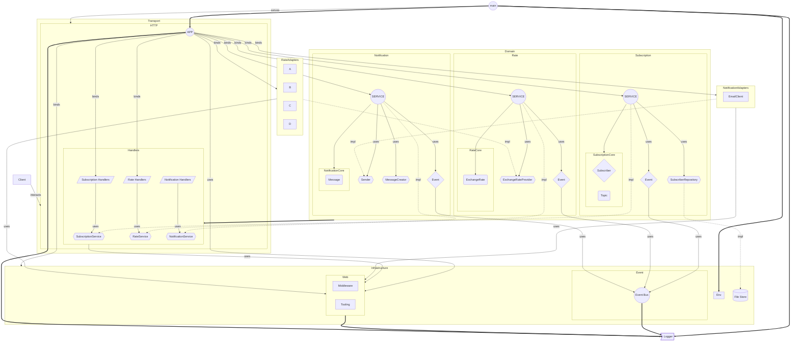
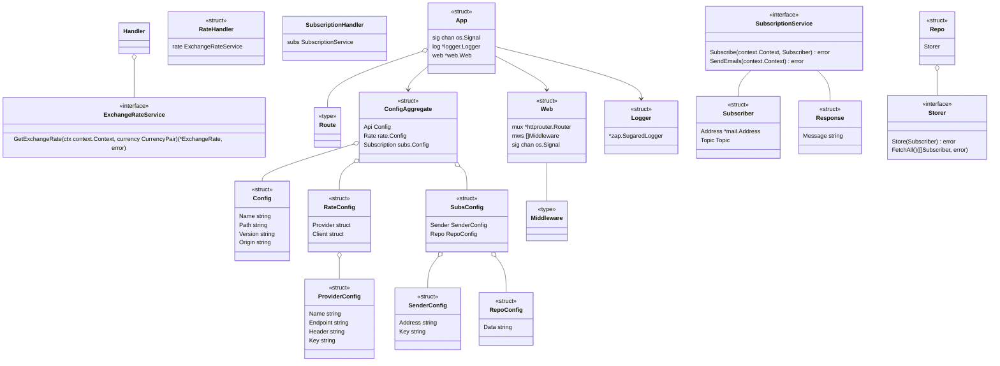

# xrate 
>Genesis Software Engineering School 3.0 project

## Description

The **xrate** project solves the problem of providing a backend API for fetching currency exchange rates from base to
quote currency pairs, which can be fiat or crypto.

## Tooling

### API

The main service of the project.

### Log consumer

Command line tool for consuming kafka logs.

## Doc

[openapi.yaml](doc%2Fopenapi.yaml)

## Introduction

The application is divided into several key modules as detailed below:

- **app**: Contains the application's entry point with `ctrl` package which is use case controller responsible for binding all dependencies.
- **data**: Contains file store, or raw data.
- **doc**: Contains openapi documentation.
- **internal**: Contains the core application logic divided into `rate`, `subs`, and `notif` packages.
- **script**: Contains auxiliary scripts for various tasks.
- **sys**: Contains system-level packages like `env`,  `event`, `web`, `filestore`, and `logger`.
- **test**: contains test related data like a *postman* collection with Dockerfile and `mock` package.
Each module is responsible for a specific function within the application, allowing for clear separation of concerns and
making the codebase easy to manage and navigate.

## Installation and Setup

```shell
make install
```

```shell
make run
```

```shell
make docker-build
 ``` 

```shell
make docker-run
 ```  

## Architecture



## Entities

--TODO: Finish

